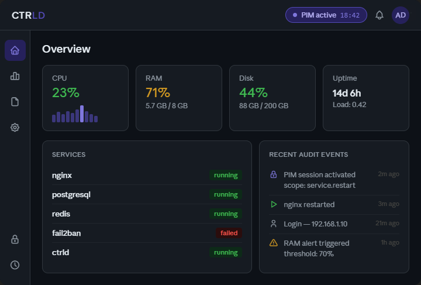

<div align="center">
  
  <h1>CTRLD</h1>
  <p><strong>Modern, security-first server control panel — a better alternative to cPanel.</strong></p>

  [](LICENSE)
  [](go.mod)
  [](.nvmrc)
  [](https://github.com/Thoomaastb/CTRLD/releases)
  [](https://github.com/Thoomaastb/CTRLD/actions)
</div>

---

## What is CTRLD?

CTRLD ("Controlled") is an open-source server control panel built with security as the foundation — not an afterthought.

- **Zero Trust architecture** — every request authenticated and authorized
- **PIM (Privileged Identity Management)** — time-limited admin privileges with mandatory MFA, inspired by Microsoft Entra PIM
- **Append-only audit log** — every action recorded, nothing deletable
- **Modern UI** — dark-first, clean design, no 1990s panel aesthetics

> ⚠️ **Pre-release software.** Not yet suitable for production use. Currently in active development toward v1.0.0.

---

## Features

### ✅ Implemented

| Feature | Status |
|---|---|
| Go backend with health endpoint | ✅ |
| Next.js 16 frontend with design system | ✅ |
| SQLite with goose migrations | ✅ |
| Argon2id password hashing | ✅ |
| JWT authentication (15 min access / 7 day refresh) | ✅ |
| TOTP MFA with QR code + backup codes | ✅ |
| PIM engine with break-glass support | ✅ |
| Append-only audit log (DB trigger protected) | ✅ |
| Setup wizard | ✅ |
| User management with last-admin protection | ✅ |
| Rate limiting (3 failures → 5 min, 10 → 1h) | ✅ |
| `/proc`-based live metrics collector | ✅ |
| WebSocket live metrics stream | ✅ |
| System inventory (hostname, OS, CPU, Docker) | ✅ |
| Full network interface inventory (incl. Docker bridges) | ✅ |

### 🔄 In Progress

| Feature | Status |
|---|---|
| Dashboard frontend with live widgets | 🔄 |
| Alert system | 🔄 |

### 📋 Roadmap to v1.0.0

| Block | Features |
|---|---|
| **Dashboard Frontend** | Live CPU/RAM/Disk widgets, Sparklines, System info panel |
| **Alert System** | Configurable thresholds, toast notifications, alert history |
| **Log Viewer** | journald, syslog, live-tail, filter, export |
| **Services** | systemd management, start/stop/restart, service logs |
| **Beta / Hardening** | One-line installer, TLS management, auto-updates |
| **v1.0.0** | Pen-test, full docs, performance validation |

---

## Security Architecture

CTRLD is built on the principle that **security must be the default, not an option**.

```
Browser (React/Next.js)
    ↓ HTTPS / WSS
API Gateway + Auth Layer (Go)
    JWT · Rate Limiting · PIM-Check · TLS
    ↓
Backend Modules (Go)
    Monitoring | Logs | Services | PIM-Engine | Audit-Logger
    ↓
SQLite                        In-Memory Store
Users · Sessions · PIM        Live Metrics · WebSocket
    ↓
Linux System Layer
    systemd · journald · /proc · D-Bus
```

### Key Security Properties

- **Argon2id** password hashing (OWASP-compliant parameters)
- **JWT with short TTL** (15 min) + server-side invalidation
- **PIM** — every privileged action requires fresh MFA + time-boxed session
- **Audit log** protected by DB triggers (no UPDATE/DELETE possible)
- **No user enumeration** — identical error messages for wrong email/password
- **Timing-attack protection** — Argon2id runs even for non-existent users
- **Security headers** on every response (CSP, HSTS, X-Frame-Options, etc.)

---

## Tech Stack

| Layer | Technology |
|---|---|
| Backend | Go 1.26+ |
| Frontend | Next.js 16, React 19, TypeScript |
| Database | SQLite via sqlc + goose |
| Auth Hashing | Argon2id |
| MFA | TOTP (RFC 6238), Passkey/FIDO2 (planned) |
| JWT | golang-jwt/jwt v5 |
| HTTP Router | chi v5 |
| WebSocket | gorilla/websocket |
| Frontend State | React Query v5 + Zustand v5 |
| Styling | Tailwind CSS v4 |
| Components | Radix UI |
| Icons | Lucide Icons |
| Logging | zerolog |
| Versioning | Semantic Release + Conventional Commits |

---

## Quick Start (Development)

### Prerequisites

- Go 1.26+
- Node.js 24+
- GCC (for go-sqlite3 CGO)

### Backend

```bash
# Copy and configure
cp config.example.yaml config.yaml
# Set jwt_secret to a random 32+ char string

# Run
go run ./cmd/ctrld -config config.yaml
# → http://localhost:8443
```

### Frontend

```bash
cd web
cp .env.example .env.local
npm install
npm run dev
# → http://localhost:3000
```

Open `http://localhost:3000` — you'll be guided through the setup wizard on first run.

---

## License

CTRLD is licensed under the **CTRLD Non-Commercial License v1.0**.

- ✅ **Free** for personal use, homelab, non-profit, open-source projects
- ✅ Attribution required: "Powered by CTRLD" with a link to ctrld.io
- ❌ **Commercial use requires a paid license** (hosting providers, MSPs, SaaS, agencies)

Commercial inquiries: [license@ctrld.io](mailto:license@ctrld.io)

See [LICENSE](LICENSE) for full terms.

---

## Contributing

See [CONTRIBUTING.md](CONTRIBUTING.md) for contribution guidelines, commit conventions, and the CLA requirement.

## Security

See [SECURITY.md](SECURITY.md) for responsible disclosure policy.

---

<div align="center">
  <sub>Built with ♥ — Security first, always.</sub>
</div>
