<div align="center">

# CTRLD

**The server control panel cPanel should have been.**

A modern, security-first, self-hosted server control panel — built with Zero Trust architecture, Privileged Identity Management, and a UI you'll actually enjoy using.

[](https://github.com/Thoomaastb/CTRLD/blob/main/LICENSE)
[](https://github.com/Thoomaastb/CTRLD/releases)
[](https://go.dev)
[](https://nextjs.org)
[](https://github.com/Thoomaastb/CTRLD/stargazers)

[**Features**](#features) · [**Quick Install**](#quick-install) · [**UI Mockups**](#ui-mockups) · [**Roadmap**](#roadmap) · [**Contributing**](#contributing) · [**License**](#license)

</div>

---

## Why CTRLD?

Existing panels were built in a different era. cPanel is expensive and closed. Webmin looks like it's from 2003. ISPConfig is powerful but overwhelming. None of them were designed with modern security in mind.

CTRLD is different:

- **Security is the architecture, not a feature.** Zero Trust from the ground up, Least Privilege by default.
- **PIM built in.** Time-limited elevated access with mandatory re-authentication — like Microsoft Entra PIM, but self-hosted and free.
- **A UI that doesn't embarrass you.** Dark-first, modern, premium — not a Bootstrap table from 2009.
- **Works everywhere.** Behind NAT, CGNAT, a home firewall. No port forwarding required for multi-server setups.

---

## Features

### 🔐 Security-first by design

- **Privileged Identity Management (PIM)** — time-limited elevated access with mandatory MFA re-authentication on every activation. A compromised session cannot trigger privileged actions without your physical MFA device.
- **Zero Trust architecture** — every request is authenticated and authorized, no implicit trust.
- **Modern MFA** — TOTP (Google Authenticator, Microsoft Authenticator, Authy, 1Password), Passkeys (Face ID, Touch ID, Windows Hello), and FIDO2 hardware keys (YubiKey, Nitrokey).
- **Append-only audit log** — every action logged with user, IP, timestamp, and PIM context. Nothing can be deleted.
- **Brute-force protection** — automatic IP lockout with escalating timeouts.

### 📊 Monitoring · 📝 Logs · ⚙️ Services

- Live system metrics via WebSocket — CPU per core, RAM, disk I/O, network throughput
- Real-time log streaming (journald, syslog, auth.log) with live-tail, filtering, and export
- Full systemd service management — critical services require an active PIM session to modify

### 🖥️ Multi-server (Hub-Spoke)

- Manage multiple servers from one panel — spoke-initiated connections, no inbound ports required
- Works behind NAT, CGNAT, and home firewalls — one-time key registration, per-spoke permissions

---

## UI Mockups

> These are design mockups created during the planning phase. The final UI may differ. No code has been written yet.

| Dashboard | Log viewer | Service controls |
|---|---|---|
|  | 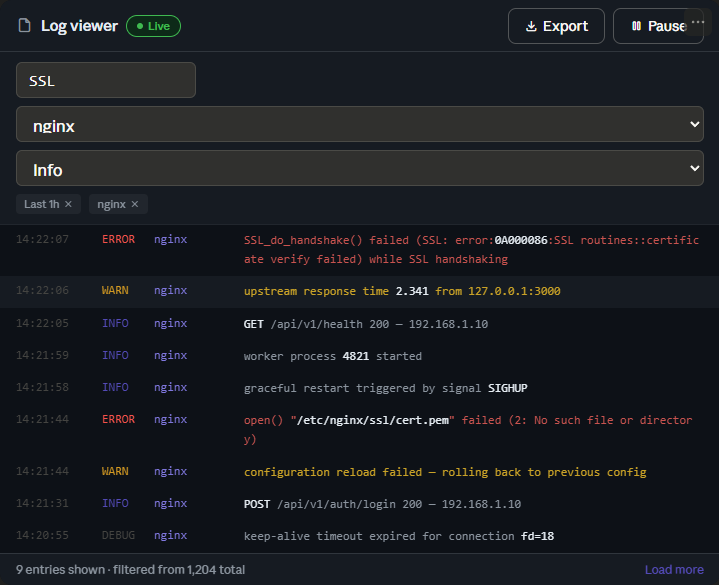 | 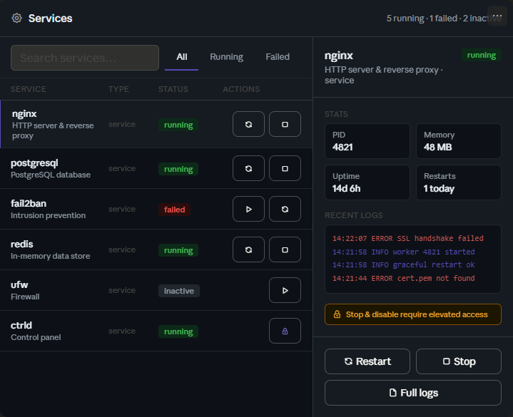 |

| Login flow | MFA setup | PIM activation |
|---|---|---|
| 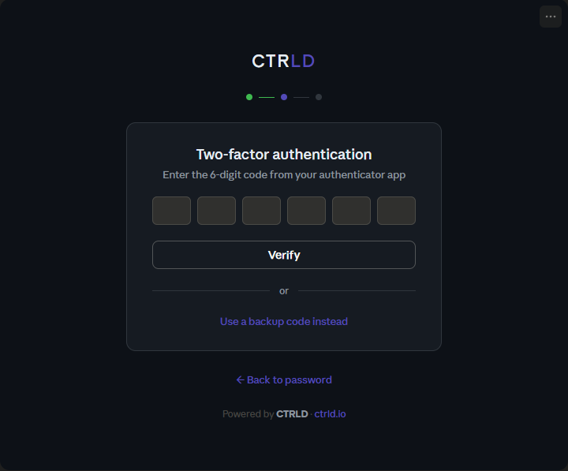 | 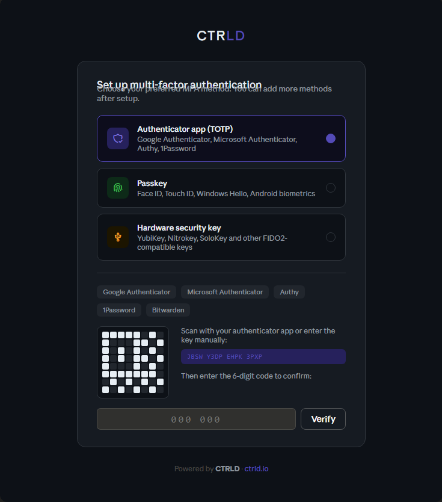 | 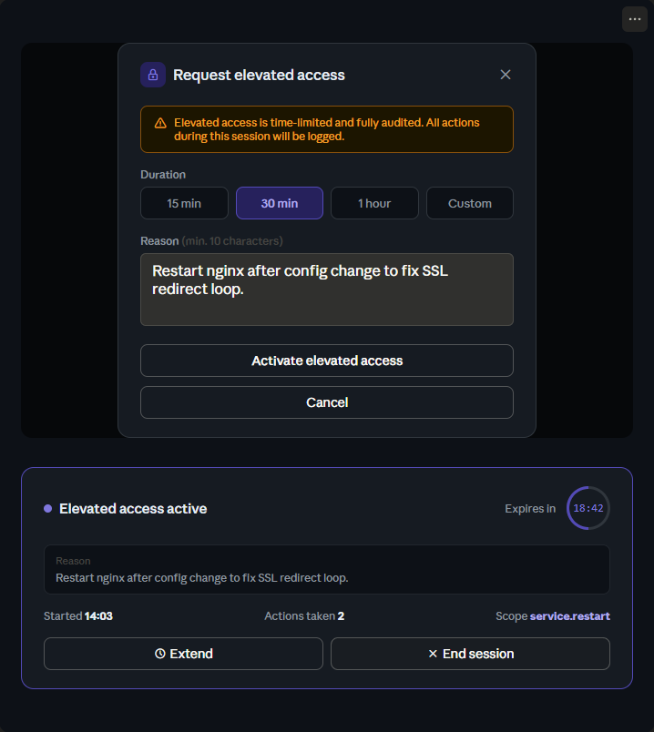 |

| Setup wizard | Audit log | Public status page |
|---|---|---|
| 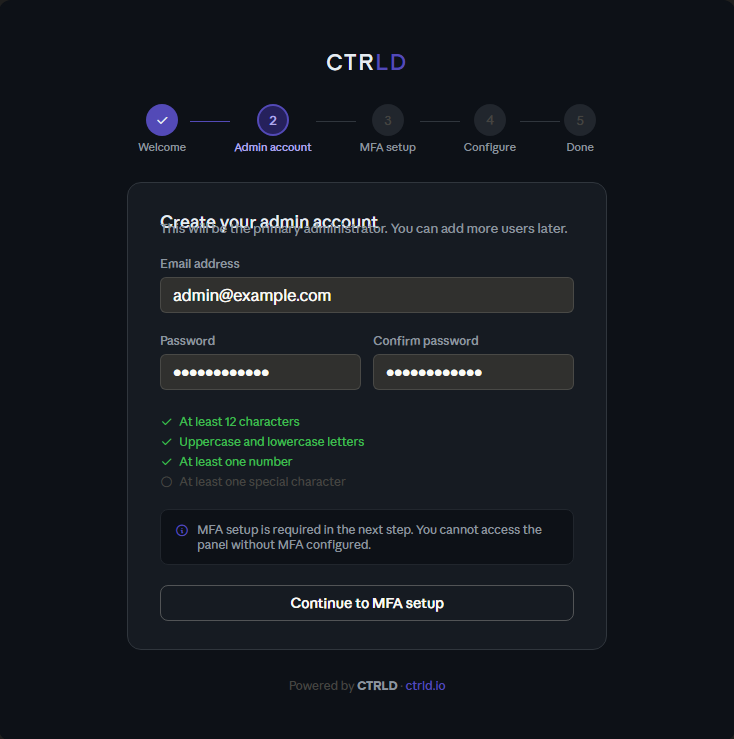 | 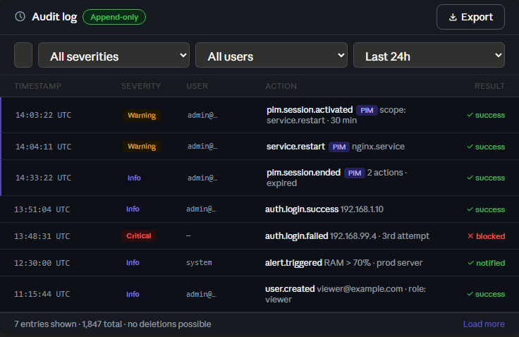 | 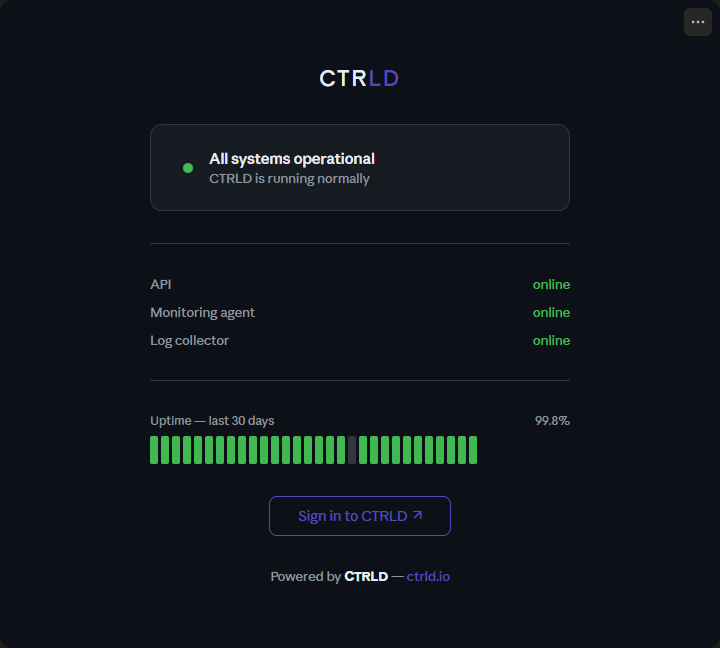 |

| Hub overview | Hub settings | Spoke dashboard |
|---|---|---|
| 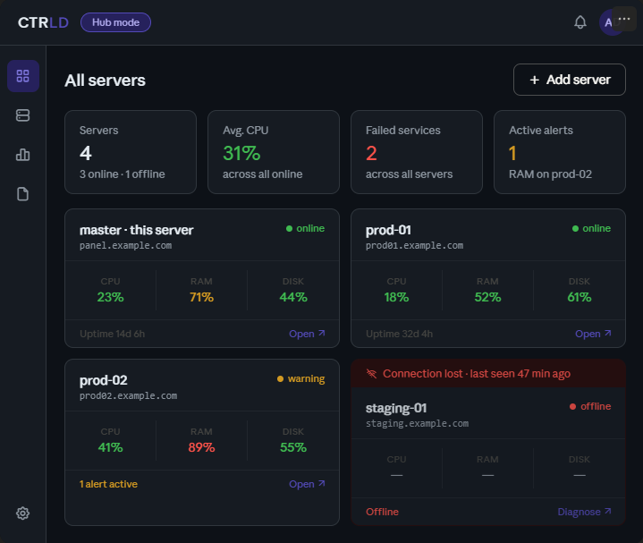 | 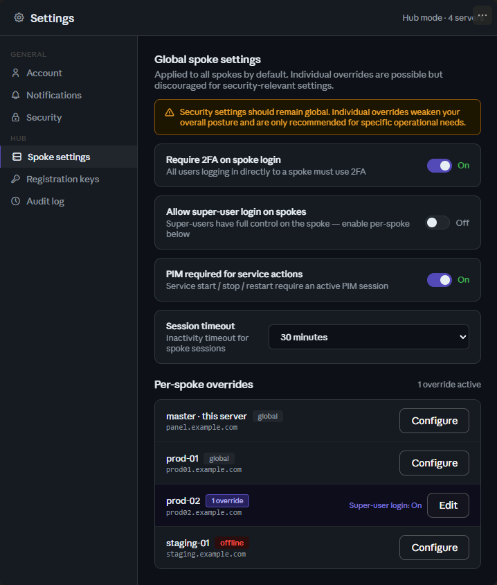 | 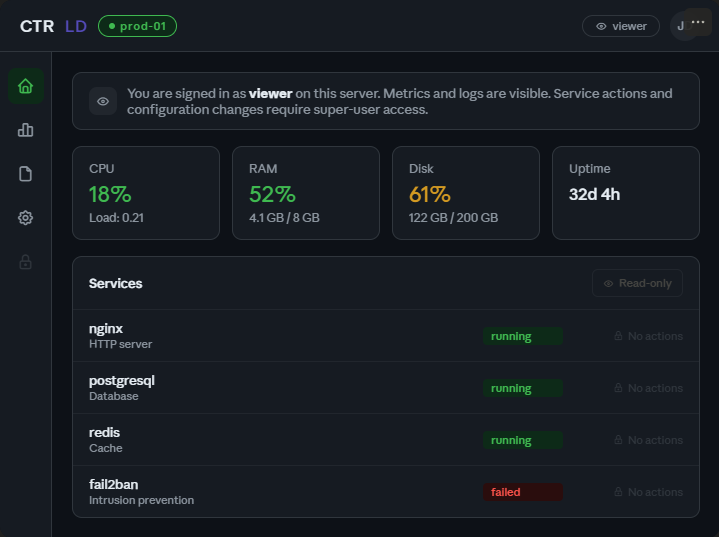 |

---

## Quick Install

```bash
curl -fsSL https://get.ctrld.io | bash
```

Supports **Debian 11/12** and **Ubuntu 22.04/24.04** · amd64 and arm64

> **Not available yet** — installer will be released with v0.9.0. Watch the repo for updates.

---

## Roadmap

| Version | Focus | Status |
|---|---|---|
| **v0.1.0** | Project setup, CI/CD, foundations | 🔧 In progress |
| **v0.2.0** | Auth, MFA (TOTP + Passkey + FIDO2), PIM, audit log | 📋 Planned |
| **v0.3.0** | Dashboard, live monitoring | 📋 Planned |
| **v0.4.0** | Log viewer, live tail | 📋 Planned |
| **v0.5.0** | Service management | 📋 Planned |
| **v0.9.0** | Installer, TLS, security hardening | 📋 Planned |
| **v1.0.0** | Stable release | 🎯 Target |
| **v2.x** | Domains, SSL, Docker, Multi-server, OIDC/SSO | 🔭 Future |
| **v3.x** | FTP, web server, databases, Hub-SSO | 🔭 Future |

Full roadmap: [Open issues](https://github.com/Thoomaastb/CTRLD/issues) · [Discussions](https://github.com/Thoomaastb/CTRLD/discussions)

---

## Tech Stack

| Layer | Technology |
|---|---|
| Backend | Go |
| Frontend | React / Next.js / TypeScript |
| Database | SQLite (v1.x) |
| Auth | Argon2id · JWT · WebAuthn (TOTP, Passkey, FIDO2) |
| Real-time | WebSocket |
| Versioning | Semantic Release + Conventional Commits |

---

## Contributing

CTRLD is in early development — feedback is the most valuable contribution right now.

- ⭐ **Star the repo** — helps more people find the project
- 🐛 [**Open an issue**](https://github.com/Thoomaastb/CTRLD/issues/new/choose) — bugs, feature requests, questions
- 💬 [**Join a discussion**](https://github.com/Thoomaastb/CTRLD/discussions) — share your use case, vote on features
- 🔧 **Submit a PR** — see [CONTRIBUTING.md](CONTRIBUTING.md) for the process

All contributors must sign the [CLA](CONTRIBUTING.md#cla) before a PR can be merged.

---

## License

CTRLD is released under the **CTRLD Non-Commercial License v1.0**.

**Free for:** personal use, homelab, non-profit, education, open-source projects.
**Requires a commercial license for:** hosting providers, managed services, SaaS, or any commercial deployment.
**Attribution required:** display "Powered by CTRLD" with a link to [ctrld.io](https://ctrld.io) (no `rel="nofollow"`).

Commercial licenses: [license@ctrld.io](mailto:license@ctrld.io) · Full text: [LICENSE](https://github.com/Thoomaastb/CTRLD/blob/main/LICENSE)

---

<div align="center">

Powered by **CTRLD** · [ctrld.io](https://ctrld.io)

</div>